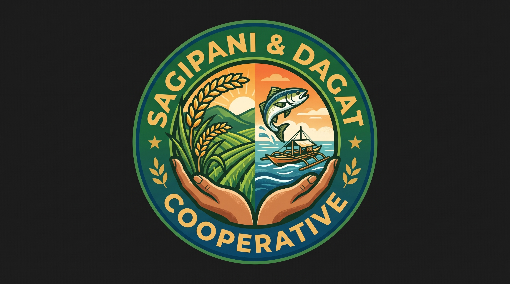

# SagipAni & Dagat Cooperative — Order & Stock Ledger System

<p align="center">
  
</p>

A fail-safe, reactive order reservation and inventory ledger built in **JavaScript with React** and **Vite**.

Designed specifically for **agricultural and fishery cooperatives** transitioning away from fragile physical notebooks and unstructured text messages.

---

## 🎯 Problems Solved by Design

| Old Notebook & SMS Process | SagipAni Smart System (By Design) |
| :--- | :--- |
| **Overselling / Over-promising**: Staff accepted SMS orders based on rough memory or outdated notebook tallies, promising more catch or produce than actually in the depot. | **Mathematical Guarantee 1 (No Overselling)**: `Available = OnHand - Reserved`. An order can **only** be accepted if `Requested <= Available`. Accepted items are **locked immediately into Reserved stock**, making concurrent over-promising impossible. |
| **Lost Stock on Cancellations**: When a restaurant or buyer cancelled a text order, staff often forgot to update the notebook, permanently losing track of available stock. | **Mathematical Guarantee 2 (Exactly-Once Restoration)**: Cancelling an order releases its reserved quantity back to available stock **exactly once**. Double-cancelling or cancelling already-dispatched orders is blocked by state machine guards. |

---

## 🔒 Formal System Invariants & State Machine

```
              ┌───────────────┐
              │  SMS / Order  │
              └───────┬───────┘
                      │
     [ validate: Requested <= Available ]
                      │
                      ▼
              ┌───────────────┐
              │   RESERVED    │ (Committed stock locked immediately;
              └──┬─────────┬──┘  Available = OnHand - Reserved)
                 │         │
[ fulfillOrder ] │         │ [ cancelOrder (restoredCount === 0) ]
                 │         │
                 ▼         ▼
        ┌───────────┐   ┌───────────┐
        │ FULFILLED │   │ CANCELLED │
        └───────────┘   └───────────┘
   (OnHand reduced;      (Reserved returned to Available;
    Cancel locked out)    Double-cancel blocked: restoredCount = 1)
```

1. **Invariant 1: Non-Negative Available Pool**
   $$\text{Available} = \max(0, \text{OnHand} - \text{Reserved}) \ge 0$$
   Every order placement checks $\forall i \in \text{items}, \text{Requested}_i \le \text{Available}_i$. If any item exceeds available stock, the entire order is rejected atomically with rollback.

2. **Invariant 2: Immediate Reservation Lock**
   $$\text{Reserved} \leftarrow \text{Reserved} + \text{Requested}$$
   Committed goods are immediately reserved upon order confirmation. Even if two orders arrive via text within seconds, the second order cannot claim the stock allocated to the first.

3. **Invariant 3: Idempotent Exact-Once Cancellation**
   $$\text{Condition: } \text{status} = \text{RESERVED} \land \text{restoredCount} = 0$$
   $$\text{Action: } \text{Reserved} \leftarrow \text{Reserved} - \text{Requested}, \; \text{restoredCount} \leftarrow 1, \; \text{status} \leftarrow \text{CANCELLED}$$
   Subsequent cancellation attempts are strictly rejected (`ALREADY_CANCELLED`), ensuring stock cannot be double-credited.

4. **Invariant 4: Fulfilled Order Cancellation Immunity**
   Once goods are physically dispatched (`FULFILLED`), cancellation is forbidden (`ALREADY_FULFILLED`).

---

## 🚀 Key Features

1. **Real-Time Stock & Products Catalog**:
   - 3-tier stock breakdown for each catch & crop: **Available to Order**, **Committed/Reserved**, and **Physical On-Hand**.
   - Visual allocation meters and low-stock threshold alerts.
   - Quick restock integration for incoming boat landings and farm trucks.

2. **SMS / Text Message Order Intake Simulator**:
   - Paste raw customer text messages (e.g., *"Order po Nanay Cora: 5kg Tilapia at 10kg Kamatis"*).
   - Natural language item extraction, buyer name, and phone recognition.
   - **Live pre-flight availability check**: highlights shortages and blocks reservation if stock is insufficient.

3. **Orders & Dispatch Management**:
   - Filter by status (`RESERVED`, `FULFILLED`, `CANCELLED`).
   - One-click *Fulfill & Dispatch* (deducts physical inventory).
   - One-click *Cancel Order & Restore Stock* with reason selector and audit timestamp.
   - Order timeline drawer tracking every transition.

4. **Automated Invariant Proof Lab**:
   - Interactive testing lab executing 5 automated proofs against the live reactive state machine.
   - Live attack simulators: simulate oversell attempts, rapid double-cancels, and cancel-on-fulfilled edge cases.

5. **Immutable Stock Audit Ledger**:
   - Complete historical ledger logging every reservation, cancellation restoration, fulfillment, and harvest restock with before/after balance snapshots.

---

## 🛠️ Tech Stack & Scripts

- **Framework**: React 19 + Vite
- **Styling**: Vanilla CSS (Tailored Agri-Fishery Theme: deep sea teal, farm emerald, warm sun amber)
- **Icons**: Lucide React

```bash
# Install dependencies
npm install

# Start development server
npm run dev

# Run automated domain invariant verification tests
npm test

# Build production bundle
npm run build
```
